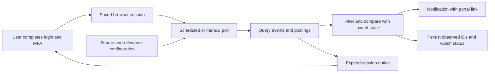

# Ross Recruit Alerts

**A recruiting opportunity monitor built by Neeraj Banisetti.** Ross Recruit Alerts turns repeated checks of a recruiting portal into notifications about new events, job postings and watched registration openings.

Built for an MBA recruiting workflow, the project demonstrates product skills in problem framing, prioritization, relevance filtering, notification design and operating a service with expiring authentication.

[Product case study](docs/product-case-study.md) · [Setup and operations](docs/setup.md)

## The user problem

A recruiting candidate needs to notice useful opportunities while balancing coursework, applications and networking. Checking a portal repeatedly takes attention; broad alerts create noise. The product hypothesis is that filtered notifications with a direct route back to the portal can reduce monitoring effort and help candidates act sooner.

The core job: **“Tell me when a relevant opportunity appears or registration opens, so I can decide whether to act.”**

## What the product does

| Capability | User value | Implementation |
| --- | --- | --- |
| New event and posting detection | Bring changes to the user | Authenticated queries and saved item IDs in `poll.py` |
| Configurable relevance | Focus attention on useful opportunities | Company matching, status filters and exclusions in `config.yaml` |
| Registration watch | Notice when an existing event becomes actionable | Detect a watched event’s transition to open registration |
| First-run baseline | Avoid an initial flood of old opportunities | Save existing items without sending the normal new-item digest |
| Email and optional push | Reach users in their existing channels | SMTP and an optional ntfy topic |
| Session-expiry notices | Make service interruption visible | Suppress repeated expiry notices; route email to the administrator |
| Session renewal tools | Reduce recovery steps | Local browser login, session upload and workflow verification |

The snapshot mode and test-email mode are separate, explicitly triggered paths. Users still sign in and approve MFA themselves; the service does not apply to jobs or register for events.

## Product decisions and tradeoffs

- **Start with the existing workflow.** Notifications link back to Ross Recruit rather than introducing another application or dashboard.
- **Prioritize signal over completeness.** Configurable filters and a bounded job-posting scan reduce noise and polling scope, but can omit opportunities. Current filters reflect one recruiting context and need review before reuse.
- **Avoid onboarding overload.** The baseline establishes state before sending new-item notifications. Registration watches require separate validation: the current baseline also records watch status without sending.
- **Treat reliability as part of the experience.** An expired session creates an actionable maintenance notice. Renewal remains human assisted because authentication requires user participation.
- **Choose a small operating footprint.** Python, Playwright and GitHub Actions keep the architecture compact. Scheduled Actions can be delayed, so this is periodic monitoring rather than a real-time guarantee.

## How it works

| File | Responsibility |
| --- | --- |
| `poll.py` | Retrieval, filtering, change detection and notifications |
| `config.yaml` | Source queries, company filters and registration watches |
| `login.py` / `auto_login.py` | User-assisted session capture |
| `renew.sh` / `watch_and_renew.sh` | Local renewal and cloud-run verification |
| `.github/workflows/poll.yml` | Scheduled execution and state persistence |
| `seen.json` | Recorded item IDs, short labels and registration state |

## Evidence and limitations

The repository contains implementation and persisted polling state. It does **not** establish active-user counts, time saved, alert precision or recruiting outcomes; no such metrics are claimed. The [case study](docs/product-case-study.md) defines how to test the product hypothesis.

Known constraints include portal-specific query IDs, delayed schedules, expiring sessions and incomplete delivery guarantees. State is saved before the normal notification is sent, so a delivery failure can leave items recorded without a delivered alert. The workflow also suppresses state-commit failures. These are concrete reliability improvements to address before expanding usage.

## Run it

See [setup and operations](docs/setup.md) for dependencies, user-assisted login, secrets, notification settings and renewal. A live instance needs authorized portal access and real credentials; the public repository is a portfolio reference, not a hosted demo.
